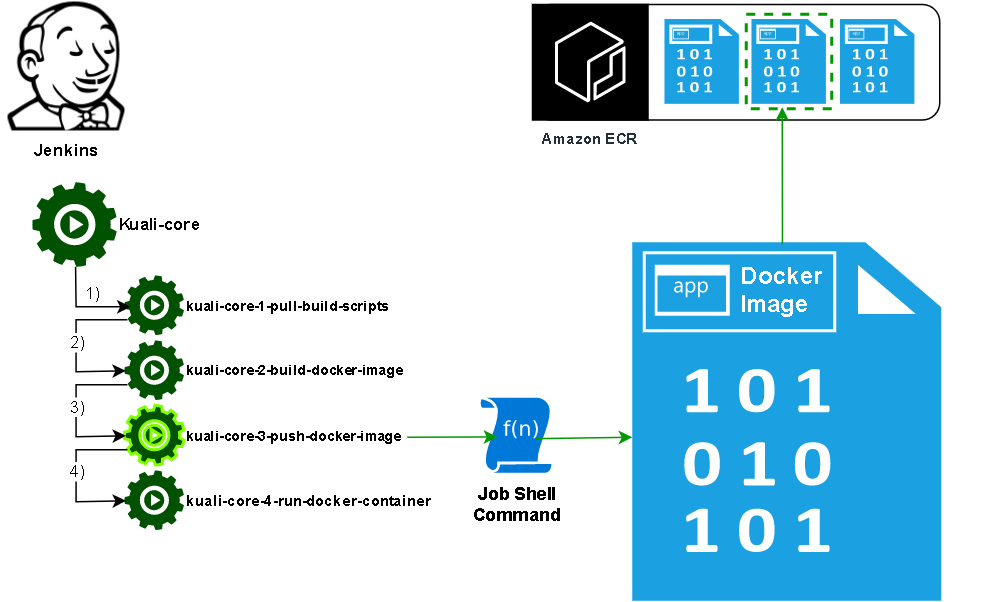

### Jenkins Job 3

#### Push the new docker image to the docker registry.

At this point the docker image has been built and needs to be uploaded to a registry.
For BU, the registry used is the Elastic Container Registry service in our Kuali AWS account.

[|-- Prior job](Jenkins2.md)[Next job --|](Jenkins4.md)

