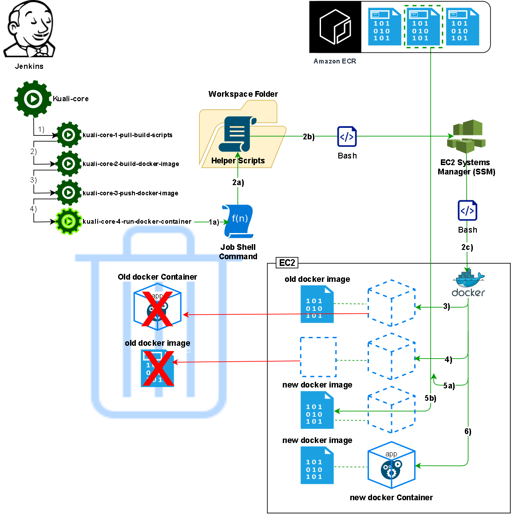

### Jenkins Job 4

#### Upgrade the application servers.

Issue commands using the AWS system manager to the EC2 instance(s) to acquire the new docker image and restart their containers against the new release it contains.

The sequence of actions depicted below are:

1. Trigger the jenkins job
2. The job runs a shell command to call a function in one of the helper bash scripts to package a series of bash commands and issue the to the EC2 Systems Manager service (SSM) using the AWS CLI.
3. The SSM invokes the commands on the remote application host (an EC2 instance), the first among them being a command to delete the currently running docker container comprising the prior version of the application.
4. The next SSM command is to prune any unused docker images. The "dangling" docker images will probably include the image for the application of the prior release.
5. The next SSM command 

[|-- Prior job](Jenkins3.md)

