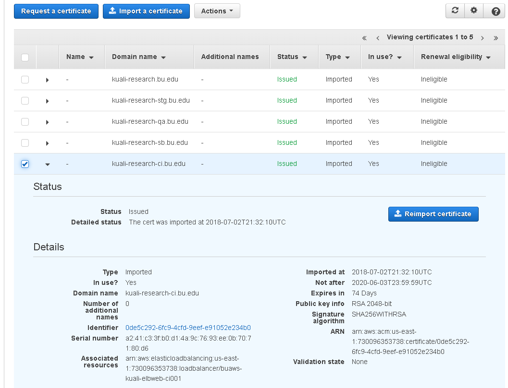

### Renew SSL Certificates

Amazon web services documentation describes the ACM service as:

> *AWS Certificate Manager is a service that lets you easily provision, manage, and deploy public and private Secure Sockets Layer/Transport Layer Security (SSL/TLS) certificates for use with AWS services and your internal connected resources. SSL/TLS certificates are used to secure network communications and establish the identity of websites over the Internet as well as resources on private networks. AWS Certificate Manager removes the time-consuming manual process of purchasing, uploading, and renewing SSL/TLS certificates*

For kuali resources in our AWS account, we simply import certificates provided to us from IS&T Infrastructure Operations Systems Administrators (probably obtained from digicert). We do not use ACM to request them. In the graphic below is shown a particular domain that will see its certificate expire in 74 days. Whoever is administering the kuali cloud resources for BU would receive a secure datamotion email with several files associated with SSL/TLS for the new certificate:

- Certificate file
- Private key file
- Certificate chain file

You can replace the existing certificate with the new one using the AWS management console.

[https://console.aws.amazon.com/acm/home?region=us-east-1#/](https://console.aws.amazon.com/acm/home?region=us-east-1#/)




Another option is to replace the certificate using the AWS CLI.
This example was used to replace the certificate for our staging environment and can be adapted fairly easily to repeat the same procedure for the certificate pictured above.

```
# 1) Import the new certificate.
aws acm import-certificate \
  --certificate file://kuali-research-stg_bu_edu_cert.cer \
  --private-key file://kuali-research-stg.bu.edu-2048bit-sha256-2019.key \
  --certificate-chain file://kuali-research-stg_bu_edu_interm.cer
  
  #(Note: use fileb://... if using CLI 2)

# 2) Get a list of load balancer names
aws elb describe-load-balancers | grep "LoadBalancerName"

# 3) Get the ARN of the cert that was just uploaded and the ARN of the cert it replaces.
aws acm list-certificates

# 4) Using the selected ELB name and certificate ARN, change the certificate being used for the ELB https listener.
aws elb set-load-balancer-listener-ssl-certificate \
--load-balancer-name buaws-kuali-elbweb-stage001 \
--load-balancer-port 443 \
--ssl-certificate-id arn:aws:acm:us-east-1:730096353738:certificate/9d220f4f-8077-4967-8b51-24d5f8d9afa6

# 5) [OPTIONAL]: You should now be able to delete the old certificate now that it has been dissacociated from the elb.
aws acm delete-certificate \
  --region us-east-1 \
  --certificate-arn arn:aws:acm:us-east-1:730096353738:certificate/1495fc31-7255-4324-b5c3-4c2747f6c799
```

